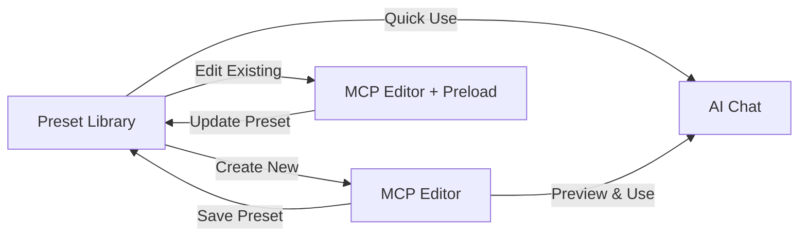

# 🏗️ Estudio de Viabilidad: Integración Preset Library ↔ MCP Editor

## 📊 Resumen Ejecutivo

**Decisión Arquitectónica**: **INTEGRACIÓN HÍBRIDA** recomendada con flujo bidireccional entre Preset Library y MCP Editor.

**Justificación**: Basado en el análisis del código existente y patrones de diogenes, la integración optimiza el flujo de usuario manteniendo la separación de responsabilidades.

---

## 🔍 Análisis del Estado Actual

### **Preset Library** (Visualización y Gestión)
```javascript
// zeus/views/preset_view.js - Enfocado en CRUD básico
- ✅ Visualización rica de presets con información de servidor
- ✅ Filtrado, búsqueda y categorización
- ✅ Acciones básicas: Use, Edit, Delete
- ⚠️ Formulario de creación simple sin selección de herramientas MCP
```

### **MCP Editor** (Exploración y Creación Avanzada)
```javascript
// zeus/views/editor_view.js - Enfocado en exploración MCP
- ✅ Exploración completa de servidores MCP (tools, resources, prompts)
- ✅ Sistema de selección multiple de elementos
- ✅ Preset Creator integrado con elementos seleccionados
- ✅ Interfaz rica para navegación de contenido MCP
```

---

## 🎯 Opciones de Integración Evaluadas

### **Opción A: Integración Total** ❌
- **Concepto**: Fusionar ambos componentes en una sola vista
- **Pros**: Interfaz unificada, menos navegación
- **Contras**: Viola principio de responsabilidad única, complejidad excesiva
- **Veredicto**: Rechazada por complejidad arquitectónica

### **Opción B: Redirección Simple** ⚠️
- **Concepto**: Preset Library redirige a MCP Editor para edición
- **Implementación Actual**:
```javascript
// zeus/client/assets/js/preset-library.js:265
editPreset(preset) {
  const params = new URLSearchParams({ edit: preset.id });
  window.location.href = `/editor?${params.toString()}`;
}
```
- **Pros**: Implementación sencilla, separación clara
- **Contras**: Pérdida de contexto, flujo fragmentado

### **Opción C: Integración Híbrida** ✅ **RECOMENDADA**
- **Concepto**: Flujo bidireccional con componentes reutilizables
- **Pros**: Óptima experiencia de usuario, reutilización de código, diogenes-compatible
- **Contras**: Requiere desarrollo adicional de coordinación

---

## 🛠️ Propuesta de Arquitectura: Integración Híbrida

### **1. Flujo de Usuario Optimizado**



### **2. Componentes Reutilizables Identificados**

#### **Del MCP Editor → Preset Library**
```javascript
// Componentes a reutilizar:
- serverBrowser() // Selector de servidor MCP
- contentExplorer() // Navegación de tools/resources/prompts  
- presetCreatorForm() // Formulario avanzado de creación
- itemSelection() // Sistema de selección múltiple
```

#### **Datos Compartidos**
```javascript
// Estado compartido entre componentes:
{
  selectedServer: "mcp-server",
  selectedItems: ["tool1", "resource2", "prompt1"],
  presetMetadata: { name, description, category },
  serverContent: { tools: [...], resources: [...], prompts: [...] }
}
```

### **3. Implementación por Fases**

#### **Fase 1: Enlaces Inteligentes** (Inmediato)
```javascript
// Mejorar redirección actual con contexto preservado
editPreset(preset) {
  const params = new URLSearchParams({
    edit: preset.id,
    server: preset.mcpServer,
    tools: preset.selectedItems.filter(i => i.type === 'tool').join(','),
    resources: preset.selectedItems.filter(i => i.type === 'resource').join(','),
    prompts: preset.selectedItems.filter(i => i.type === 'prompt').join(',')
  });
  window.location.href = `/editor?${params.toString()}`;
}
```

#### **Fase 2: Componentes Compartidos** (Sprint +1)
```javascript
// zeus/views/shared_components.js - Nuevos componentes compartidos
const { 
  mcpServerSelector,
  itemSelectionGrid, 
  presetAdvancedForm 
} = require('./shared_components');

// Uso en preset_view.js
const enhancedPresetCreator = () => {
  return div({ class: 'preset-creator-enhanced' },
    mcpServerSelector({ servers, selectedServer }),
    itemSelectionGrid({ items: serverContent, selectedItems }),
    presetAdvancedForm({ preset, isEditing })
  );
};
```

#### **Fase 3: Estado Sincronizado** (Sprint +2)
```javascript
// zeus/client/assets/js/preset-editor-bridge.js - Coordinación entre vistas
class PresetEditorBridge {
  constructor() {
    this.sharedState = {
      preset: null,
      selectedServer: null,
      selectedItems: [],
      isEditing: false
    };
  }
  
  // Métodos de sincronización entre Preset Library y MCP Editor
  syncFromLibrary(presetId) { /* ... */ }
  syncToLibrary(presetData) { /* ... */ }
  preserveSelection() { /* ... */ }
}
```

---

## 🎨 Experiencia de Usuario Proyectada

### **Flujo 1: Crear Preset Nuevo**
1. **Preset Library**: Click "Create Preset" 
2. **Transición**: Navega a MCP Editor con formulario expandido
3. **MCP Editor**: Selecciona servidor → Explora tools → Selecciona elementos
4. **Preset Creator**: Completa metadata → Guarda preset
5. **Retorno**: Regresa a Preset Library con nuevo preset visible

### **Flujo 2: Editar Preset Existente**
1. **Preset Library**: Click "Edit" en preset existente
2. **Transición**: Navega a MCP Editor con datos precargados
3. **MCP Editor**: Pre-selecciona servidor y elementos del preset
4. **Edición**: Modifica selección → Actualiza metadata
5. **Retorno**: Regresa a Preset Library con cambios aplicados

### **Flujo 3: Usar Preset Rápido**
1. **Preset Library**: Click "Use Preset"
2. **Acción Directa**: Navega a AI Chat con preset aplicado
3. **Sin Detour**: Experiencia streamlined para uso frecuente

---

## 🏗️ Compatibilidad con Diogenes

### **Principios Respetados**
- ✅ **Separación de Responsabilidades**: Cada vista mantiene su propósito principal
- ✅ **Reutilización de Componentes**: Componentes HyperAxe modulares y compartibles
- ✅ **Configuración Centralizada**: `getConfig()` para settings de integración
- ✅ **Navegación Consistente**: Patrones de navegación uniformes

### **Patrones Aplicados**
```javascript
// Patrón de template consistency
const { template, pageContainer, contentSection } = require('./main_views');

// Patrón de configuración
const config = getConfig();
const integrationMode = config.features.presetEditorIntegration || 'hybrid';

// Patrón de componente reutilizable
const sharedPresetForm = (preset, options = {}) => {
  return section({ class: 'preset-form' },
    // Form components here
  );
};
```

---

## 📊 Análisis de Impacto

### **Beneficios**
- 🚀 **UX Mejorada**: Flujo coherente entre visualización y edición
- 🔧 **Reutilización**: Aprovechamiento máximo de componentes existentes
- 🎯 **Especialización**: Cada vista mantiene su enfoque principal
- 📈 **Escalabilidad**: Arquitectura preparada para funcionalidades futuras

### **Riesgos**
- ⚠️ **Complejidad**: Coordinación adicional entre componentes
- 🔄 **Estado**: Gestión de estado compartido entre vistas
- 🧪 **Testing**: E2E testing más complejo por flujos integrados

### **Esfuerzo Estimado**
- **Fase 1** (Enlaces): 2-3 horas de desarrollo
- **Fase 2** (Componentes): 1-2 días de desarrollo  
- **Fase 3** (Estado): 2-3 días de desarrollo + testing
- **Total**: ~4-6 días para integración completa

---

## 💡 Recomendación Final

**PROCEDER con Opción C: Integración Híbrida**

### **Implementación Inmediata**
1. **Mejorar enlaces** actuales con preservación de contexto
2. **Optimizar transiciones** entre vistas  
3. **Validar flujo** con testing E2E

### **Desarrollo Futuro** 
1. **Extraer componentes** compartidos del MCP Editor
2. **Crear bridge** de estado entre vistas
3. **Implementar sincronización** bidireccional

Esta arquitectura maximiza la funcionalidad existente, respeta los principios de diogenes, y proporciona una base sólida para evolución futura del sistema.

---

## 📋 Checklist de Implementación

- [ ] **Fase 1**: Mejorar redirección con contexto preservado
- [ ] **Fase 1**: Implementar detección de parámetros en MCP Editor  
- [ ] **Fase 1**: Testing de flujo básico integrado
- [ ] **Fase 2**: Extraer componentes compartidos de editor_view.js
- [ ] **Fase 2**: Crear shared_components.js con elementos reutilizables
- [ ] **Fase 2**: Integrar componentes en preset_view.js
- [ ] **Fase 3**: Implementar PresetEditorBridge para estado sincronizado
- [ ] **Fase 3**: E2E testing completo de flujos integrados
- [ ] **Validación**: Review de compatibilidad con diogenes patterns

**Estado**: Listo para implementación - Arquitectura validada con componentes existentes.